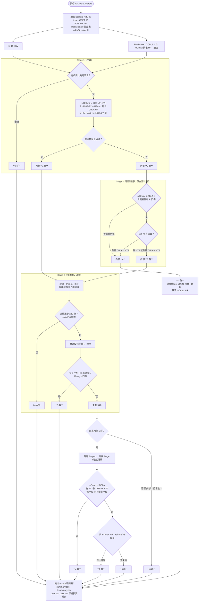

# OBLA Filter

三階段篩選 CPET／採血表與 `index/fit/` 實跑資料，輸出 4～9 群（Stage 1 無法比對為 **0 群**）。

---

## 目錄

| 路徑 | 用途 |
|------|------|
| `index/` | 所有受試相關 CSV（含 CPET；**不含** `fit/`、`lactate/` 子目錄） |
| `index/lactate/` | **每一階採血表**（Stage 1 生理指標；見下方格式） |
| `index/fit/` | 實跑預設目錄：**`.csv` / `.fit`** 可混放（含子資料夾）；`.fit` 自動轉 CSV |
| `userinfo.csv` | `No`, `Name`, `HR max`, `RHR` |
| `vt2_hr.csv` | （可選）`No`, `VT2_HR`；有值時 Stage 2 納入 **mDmax ≤ OBLA ≤ VT2**；無 VT2 則不檢查 VT2 |
| `output/YYYY-MM-DD-hh-mm/` | 每次執行輸出 |

> **採血表 vs CPET（重要）**  
> Stage 1 的 **HR（85–92% HRmax）** 與 summary 的 **OBLA_HR** 同源：R **lactater OBLA 4.0**（`mDmax.r`）。  
> **RPE／RER** 仍從 `index/lactate/` 採血表 **La 最接近 4 mmol/L** 的那一列讀取（R 不提供）。  
> **日後計畫改為直接讀 CPET 時間序**；屆時僅需調整程式內對齊邏輯，流程不變。

OBLA／mDmax 門檻 HR、速度由 R **`Listing_OBLA_Dmax_VT2/mDmax抓取/mDmax.r`**（lactater：OBLA 4.0、ModDmax）對 `index/` 內 CPET 型 CSV 計算。

---

## 環境（Python）

讀取 `index/lactate/*.xlsx` 需要 **pandas**、**openpyxl**。在 **實際用來執行腳本的那個** Python 裡安裝：

```bash
cd /Users/ansel.huang/0-Running/OBLA_Filter
python3 -m pip install -r requirements.txt
```

若終端顯示 `(base)` 卻仍 `No module named 'pandas'`，常見原因是 **`python3` 指到 macOS 內建 `/usr/bin/python3`（3.9）**，而不是 conda 的 3.13。請先確認：

```bash
which python3
python3 -c "import sys; print(sys.executable)"
```

建議擇一：

- 用 conda 直譯器：`/Users/ansel.huang/opt/miniconda3/bin/python3 run_obla_filter.py`
- 或對「你正在用的」`python3` 安裝：`python3 -m pip install -r requirements.txt`

R 門檻另需本機已安裝 **lactater**（見 `Listing_OBLA_Dmax_VT2/mDmax抓取/readme.md`）。

---

## Stage 1

在 **OBLA 4.0（R lactater）** 與採血表判斷（有值才比對，全缺 → **0 群**）：

1. RPE：採血表 La≈4 列之 `RPE`／`Borg`（6～8）  
2. HR：**R 的 OBLA 4.0 HR** 是否落在 HRmax 的 85～92%  
3. RER：採血表 La≈4 列之 `RER`（0.95～1）  

有參與比對的項目皆通過 → **1 群**；否則 **2 群**。

---

## Stage 2

僅 **Stage 1 的 2 群**：檢查強度順序是否成立（需有 R 門檻的 **mDmax HR**、**OBLA HR**）：

- 一律要求 **mDmax ≤ OBLA**。
- 若 `vt2_hr.csv` **有**該員 VT2，再要求 **OBLA ≤ VT2**；**無 VT2 則忽略**，不納入判斷。

符合 → 內部 **3 群**（進 Stage 3）；不符合、或缺 mDmax／OBLA → 內部 **4 群**（對外 **4 群**）。

---

## Stage 3

對 **1 群、3 群**，以及覆核路徑上的 **7 群候選**（見下），與 `index/fit/` 內**每一檔**個別比對：

- 連續跑步 ≥30 分鐘：仿 `IdentifyPhase` 選項 3（`splitdt16` 後牆鐘時長），門檻改 **30** 分鐘。  
- 在通過段計算平均 HR、平均速度（km/h，優先 `enhanced_speed`／`SPEED`）。  
- 與門檻 HR 比：**ref ≤ 平均 HR ≤ ref + 3 bpm**（任一通過 → **5 群**）。門檻 HR 同前（內部 1／3 路徑用 OBLA；內部 2 且 Stage2=4 用 mDmax）。  
- **納入比對**須先 **avg HR ≥ Stage 3 比對基準 ref**（與 **ref ≤ 平均 HR ≤ ref + 3 bpm** 的 ref 相同；內部 1／3 路徑為 OBLA，Stage2 歸 4 為 mDmax）；未達者不列入 summary 比對列。

皆未通過（**6 群** 過渡）：

- 原 **1 群**：略過 Stage 1，只做 Stage 2 強度邏輯（**mDmax ≤ OBLA**，有 VT2 則 **OBLA ≤ VT2**）；通過則改以 **mDmax HR** 做同上比對 → **7 群**／**9 群**；強度不通過 → **4 群**。  
- 原 **2 群** → **8 群**。

**1 群、3 群**若 Stage 3 未進 5 群，依上列分支。  
**4 群**為分群終點（不因比對升級），但仍對 ≥30 分鐘且 **avg HR ≥ mDmax** 的 fit 做 **mDmax～mDmax+3 bpm** 比對（欄位 `OBLA_Compare3_Boolean`）；`Stage2_internal=4`（強度邏輯不通過）亦同。

---

## 執行

啟動時會先出現 **篩選項目** 視窗（Tk）；勾選後才納入 Stage 1／2 比對。設定會寫入 `obla_filter_config.json`，每次執行也會複製到 `output/…/filter_config.json`。

| Stage 1 勾選 | 比對內容 |
|--------------|----------|
| 1 | RPE 6～8 |
| 2 | OBLA HR 85～92% HRmax |
| 3 | RER 0.95～1 |

| Stage 2 勾選 | 比對內容 |
|--------------|----------|
| 1 mDmax | 與 OBLA 同勾時：**mDmax ≤ OBLA**；與 VT2 同勾且有 VT2_HR 時：**mDmax ≤ VT2** |
| 2 OBLA | 與 mDmax 同勾：**mDmax ≤ OBLA**；與 VT2 同勾且有 VT2_HR：**OBLA ≤ VT2** |
| 3 VT2 | 與 OBLA 同勾且有 VT2_HR：**OBLA ≤ VT2**；與 mDmax 同勾且有 VT2_HR：**mDmax ≤ VT2** |

Stage 2 **全部未勾選** → 視為強度順序通過（內部 3 群）。Stage 1 **全部未勾選** → 無可比對項目（0 群）。

Narrative 僅列出**有勾選**的 Stage 1／2 指標（例如未勾 VT2 則不出現 VT2 數值）。

略過視窗（批次／遠端）：`--no-gui`（讀取 `obla_filter_config.json`，不存在則預設全勾選 Stage 1 與 1、2 Stage 2）。

```bash
cd /Users/ansel.huang/0-Running/OBLA_Filter
python3 run_obla_filter.py
```

選項：`--index-dir`、`--fit-dir`（可重複，指定多個實跑資料夾）、`--userinfo`、`--vt2`、`--mdmax-r`（`mDmax.r` 路徑）、`--skip-r`（略過 R，僅測試下游）、`--no-gui`、`--filter-config`。

```bash
# 額外掃描其他資料夾（內含 .csv 或 .fit）
python3 run_obla_filter.py --fit-dir index/fit --fit-dir /path/to/more_runs
```

---

## 輸出

### `YYYY-MM-DD-hh-mm_summary.csv`

| 欄位 | 說明 |
|------|------|
| No. | 受試編號（檔名開頭數字，或對 `userinfo.Name`） |
| Group | 0、4～9 |
| Filter_subject | 有參與 Stage 1 的項目：`1` RPE、`2` HR、`3` RER |
| Filter_missing | 缺失項目，如 `3` 或 `2,3` |
| OBLA_HR / OBLA_speed | R 模組 |
| mDmax_HR / mDmax_speed | R 模組 |
| VT2_HR | 來自 `vt2_hr.csv`（可空） |
| CPET_file | 用於 R 的 CPET 檔名 |
| Compare_files | 比對 fit CSV 全名 |
| Compare_files_avg_HR / Compare_files_avg_Speed | 通過 ≥30 分鐘段之平均 |
| OBLA_Compare10_Boolean / 5 / 3 | 保留欄位；**僅 `OBLA_Compare3_Boolean`** 表示 ref～ref+3 bpm 通過（`1`／`2`） |
| Stage1_internal | 內部 0/1/2（除錯用） |
| Stage2_internal | 內部 3/4 或空 |

每位受試可因多檔 fit 而有多列；`Group` 為該列所屬最終群（檔案級比對結果彙整後寫入各列一致）。

### `YYYY-MM-DD-hh-mm_fitsummary.csv`

| 欄位 | 說明 |
|------|------|
| No. | 編號 |
| Files_name | 檔名 |
| Avg_HR / Avg_Speed | ≥30 分鐘通過段平均 |
| Duration_Boolean | 通過 `1`、未通過 `2` |
| Time_Duration | 連續跑步分鐘數 |

另：`Over30/`、`Less30/` 各含 **`accepted/`**、**`declined/`**；`[群編號]/` 內放 CPET 與比對 fit 檔。

### `YYYY-MM-DD-hh-mm_verification_report.html`

互動式**訓練閾值驗證報告**：主標題為 Verification 英文說明；受試者下拉（ID · 姓名）、左側 R 門檻圖、右側模型 HR／La／速度與 **Compare3 通過**且時長前 3 的 fit 長條圖、下方 **narrative** 全文。圖檔複製至 `report_plots/`。僅重產報告：`python3 run_obla_filter.py --report-only output/時間戳/`。


### `YYYY-MM-DD-hh-mm_narrative.txt`

每位受試一段文字摘要；相符率 = `OBLA_Compare3_Boolean` 為 `1` 的筆數 ÷ 有比對的總筆數（≥30 分且 avg HR ≥ 門檻）。

### `YYYY-MM-DD-hh-mm_trust_score.csv`（信任分數）

每位受試一列。公式：**Confidence Level = Σ(Scoreᵢ × Weightᵢ)**（僅含**有資料且納入比對**的指標；缺 RER 等整項忽略，不扣分也不進分母）。總分線性換算 **`Trust_score_1_10`** ∈ **[1, 10]**（加權達成率 0→1 分、100%→10 分）。

驗證報告 toolbar 中央以與 fit 時長相同的漸層長條顯示該分數（切換受試者時更新）。

| 指標 | 權重 | 分數規則 |
|------|------|----------|
| HR（Stage 1） | 1 | 達標 **1**／否 **0**；缺 OBLA HR 或未勾選 → **不計** |
| RPE | 1 | 6～8 → **1**／**0**；缺採血 RPE → **不計** |
| RER | 1 | 0.95～1 → **1**／**0**；缺 RER → **不計** |
| Intensity logic（Stage 2） | 1 | `intensity_order_ok` → **1**／**0**；缺 mDmax/OBLA（或 VT2 檢查所需值）→ **不計**；Stage 2 全未勾選 → **1** 且納入 |
| Record（Stage 3） | 3 | 相符率 1～20%→**1** … 81～100%→**5**；無可比對 fit → **不計** |

輔助欄：`Trust_weighted_sum`、`Trust_max_weighted`；未納入的指標在 `Score_*` 欄留空。

---

## `index/lactate/` 採血表格式

UTF-8 CSV，建議檔名 `{No}_lactate.csv` 或含受試姓名。必要欄位（名稱可大小寫）：

- `La`（或 `Lactate`）  
- `HR`  
- `RPE` 或 `Borg`（可選）  
- `RER`（可選）  

程式對 RPE／RER 取 **La 最接近 4.0** 的採血列；**HR 門檻判斷只用 R OBLA 4.0**，不做 Python 内插。  
支援 **`.xlsx`**（與 `*_VO2max.xlsx` 實驗紀錄表相同欄位：`Lactate`、`HR`、`RPE`）。

**範例（黃冠儀，No. 136）**：`index/lactate/黃冠儀_VO2max.xlsx`；R 門檻可放 `index/黃冠儀_VO2max.xlsx`（日後 CPET 改放 `First_CPET_…csv`）。檔名無開頭數字時，以 `userinfo` 的 **Name** 對應 **No.**。

---

## 流程圖



---

## 群覽

**1～3** 多為 **Stage 1／2 內部**結果（`Stage1_internal`、`Stage2_internal`）；**summary 的 `Group`** 實際寫入 **0、4、5、7、8、9**。**6** 僅為流程「未進 5 群」後的分流說法，不會出現在 `Group` 欄。

| No. | describe |
|-----|----------|
| **0** | Stage 1 **完全無法比對**（RPE／HR／RER 等參與項目全缺）。`Group = 0`，不進後續 Stage 2／3 分群。 |
| **1** | **Stage 1 通過（內部）**：有參與比對的生理項目皆達標。進 **Stage 3**，以門檻 HR 做 **ref～ref+3 bpm**。最終可能為 **5**，或經過渡分流為 **7**／**9**／**4**。 |
| **2** | **Stage 1 未全過（內部）**：至少一項有比對但未達標。進 **Stage 2** 查 **mDmax ≤ OBLA**（有 VT2 則 **OBLA ≤ VT2**，無 VT2 不檢查）。強度不通過 → **4**；通過 → 內部 **3**，再進 Stage 3。 |
| **3** | **Stage 2 通過（內部）**：僅來自原內部 **2** 群；強度順序 OK。進 **Stage 3**，以 **OBLA HR** 比 fit。最終 **5**，或未進 **5** 則 **8**。 |
| **4** | **summary 終點**：Stage 2 強度不符合或缺 mDmax／OBLA；或原內部 **1** 覆核時強度不通過。**不會**因 fit 比對再升群；≥30 分 fit 仍可比 HR，基準為 **mDmax HR**（欄位名仍為 `OBLA_Compare*`）。 |
| **5** | **summary 終點**：Stage 3 成功——連續跑步 ≥30 分、avg HR ≥ 門檻，且至少一檔落在 **ref～ref+3 bpm**（內部 **1** 或 **3** 路徑）。 |
| **6** | **流程過渡（非 `Group`）**：Stage 3 **未進 5** 後的分流節點（見流程圖）。程式改判 **4**／**7**／**8**／**9**，不輸出 `Group = 6`。 |
| **7** | **summary 終點**：原內部 **1**、未進 **5**，覆核強度通過，且至少一檔 fit 落在 **mDmax～mDmax+3 bpm**。 |
| **8** | **summary 終點**：原內部 **2** 且曾內部 **3**，Stage 3 未以 **OBLA HR** 進 **5**。 |
| **9** | **summary 終點**：原內部 **1**、未進 **5**，覆核強度通過，但 **mDmax～mDmax+3 bpm** 皆未過（相對 **7** 的失敗端）。 |
